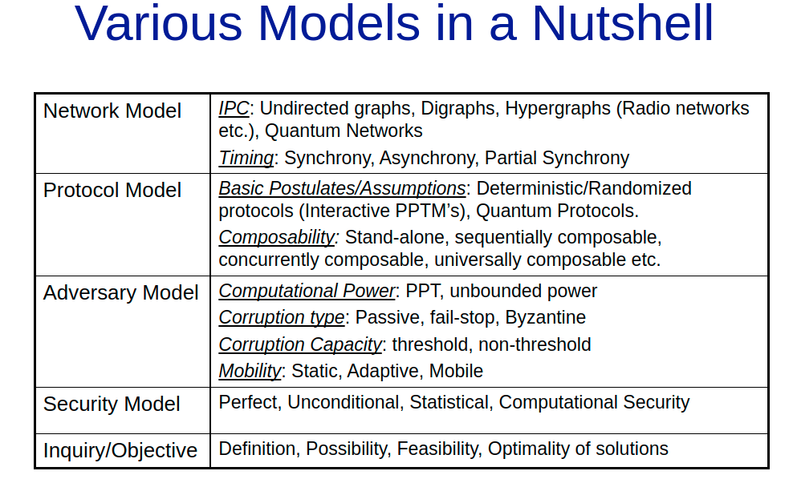
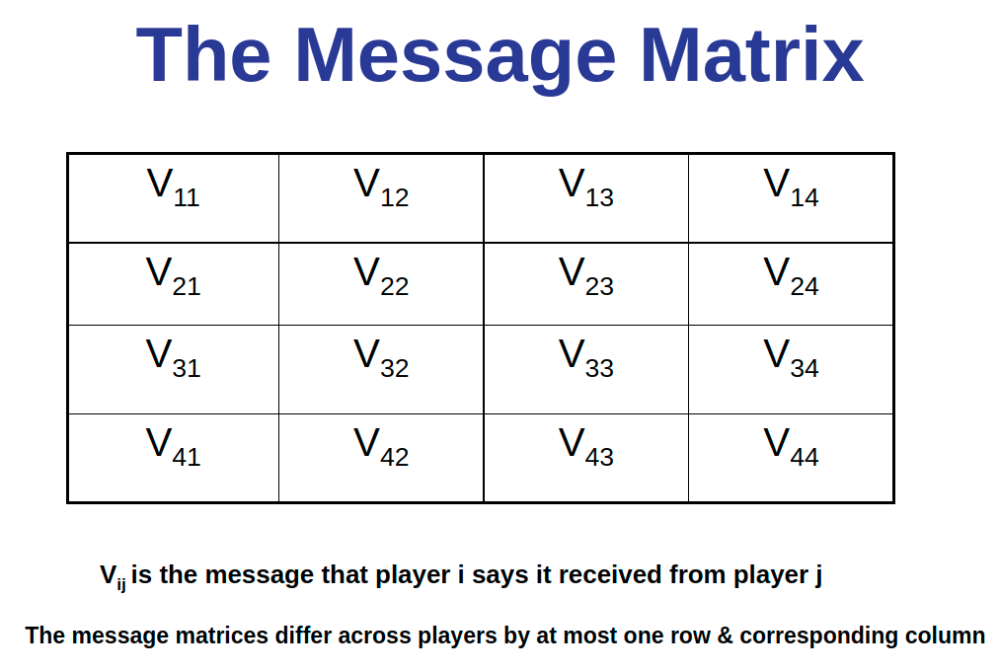

# Week-13, Lecture-2

In this lecture , we discussed Byzantine agreement , the issues that cause it and also understood the possibility of 1 out of 3 and the protocol of 1 out of 4 .

We also discussed ABA(authenticated Byzantine Agreement) , ABA protocol of 1 out of 3 , Connectivity Challenge and other methods of Consensus.

## The Byzantine agreement and understanding the issue which causes it :

The Byzantine Generals Problem is a game theory problem that describes how difficult it is for dispersed parties to reach consensus without the help of a trusted central party. How can members of a network agree on a specific reality when no one can verify the identities of other members? The Byzantine Agreement consists of the following clauses:

All the processes start with a input which is derived from a fixed set V = {0,1} . Even in the presence of an adversary who can Byzantinely corrupt up to any t of the n players, the goal is for the players to eventually produce decisions from the set V that meet the following conditions:

Let us try to think how is the agreement done even there are t players that are Byzantinely corrupted ?

The solution is they reach an agreement among themselves and decide the same value u which is in set V . If say all the non  corrupted processes or players decide on the same initial value , then u will be equal to v . This condition is also called validation .

When a decision is reached on what the final decision will be, the termination is completed.

</img>

## Impossibility of 1 out of 3:

Consider the case of a state with three generals. Assume one of them (call them General 1) is now under the grip of an opponent. General 1 might now cause havoc within his own ranks by putting General 2 against General 3 and telling them lies about each other. General 1 might inform General 2 that 3 is Byzantine, while General 3 could inform General 2 that 2 is Byzantine. Because 2 is telling 3 the same thing 1 is telling 3 about 2, 3 won't be able to distinguish the difference. This example is for n = 3 and f = 1, where n is the number of processes and f is the number of processes. We can show that we require n >= 3*f + 1 processes in this way.

## Protocol of 1 out of 4 :

The procedure consists of exchange of messages, followed by computation of interactive consistency vector on the basis of result of exchange.

Two rounds of information exchange are required:

- In the first round the processors exchange their input values.
- In the second round they exchange all the values obtained in the first round.

A "message matrix" V can be used to illustrate the representation, where V_ij represents the message that player I claims to have received from player j. Each player's message matrices differ by no more than one row and column.

</img>

## Authenticated Byzantine Agreement (ABA) :

Given an upper bound of t faulty nodes , the ABA algorithms says that for reaching an agreement based on authentication requires a total
number of messages sent by correctly operating processors that is polynomial in both t and the number of processor n . The best algorithm will use only t+1 phases and $O(nt)$ messages.

## ABA protocol for 1 out of 3 :

- Player k maintains a set Wik for all i in P. Initially, Wkk = {sigma}, where sigma is player k's input value.
- We have to repeat steps for 2 rounds :

Receive values from neighbors and for each received value perform the following:

- If the message is properly signed, append its content to the set Wik.
- Send i, W_ik to his neighbours.
- Then delete W_ik if |W_ik| != 1.
- Since all remaining W_ik are singleton sets, they take majority over all values. If a majority exists they decide on it, else they decide on the default value.

## Connectivity Challenge :

In a (synchronous) P2P network of n nodes, t of which are (Byzantine) faulty, consensus/agreement is possible only if the network is (2t + 1) connected.
With an upper bound of t Byzantined nodes , (t + 1)-connectivity is sufficient ( or just > t round will be sufficient in the worst case ).

## Round-Connectivity Challenge :

In a (synchronous) P2P network of n nodes, t of which are (fail-stop / Byzantine) faulty, consensus requires > t rounds, in the worst case.