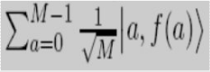
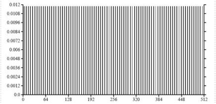

# Week 13 Lecture 1 :

In this lecture , we continued our discussion on quantum computing and discussed Shor's Algorithm which is useful for factoring integers in polynomial time . This is very important because this is widely used in cryptosystem , RSA , relies on factoring being impossible for large enough integers .  

This method is just an extension of FFT which we learned in the beginning of the course but it is modified so that we can calculate it using quantum algorithms . 

The following changes are made :

- Factoring is reduced to finding a non-trivial square root of 1 modulo N.
- Calculating the order of a random integer modulo N is all it takes to find such a root.
- The order of an integer is precisely the period of a particular periodic superposition.
- The quantum FFT is an effective way to find the periods of superpositions.

## Step 1 : Factoring and non trivial square root of 1 modulo N

 Here we prove that if x is a non trivial square root of 1 modulo N , then gcd (N,x+1) is a non - trivial factor . 

### Proof :

- $x^2=1modN->x^2-1$ is divisible by N
- $(x-1)(x+1)=0modN$
- Because N divides the product of (x+1) and (x-1), it implies that there are some non-trivial factors of N that are also factors of (x+1) and vice versa (x-1). If this isn't the case, let's assume that gcd(x-1,N) = 1, implying that (x-1) and N share no factor. As a result, N divides (x+1) (since it divides their product).This implies that x = 1 mod N, despite the fact that x is a nontrivial square root. As a result, we believe that gcd(x-1,N) is untrue. We can show the same thing for x+1.
- Hence x ≠ 1 mod N
- So N must have a non trivial factor common with each of (x-1) and (x+1).
- Finding a non-trivial factor of N is thus the same as finding a number x that is a non-trivial square root of 1. (modulo N).

## Step 2 : Computing order of modulo N by reducing non-trivial square root of 1

- The smallest positive integer r such that $x^r=1modN$ is defined as order(x).
- Let us choose  a random number x such that gcd(x,N)=1.
- If say r is even , then a non-trivial square root of 1 modulo N will be x^(r/2).
- If say r is odd, the method is repeated until an even number is found. (This would not take many trials because the probability of finding an odd-order number after finding k odd-order numbers reduces exponentially.)
- Hence , finding the non trivial square root of 1 (modulo N) is thus similar to finding an even-order number.

## Step 3 : The period of a particular periodic superposition is precisely the period of a particular periodic superposition .

- There is no efficient classical algorithm for finding order of x modulo N .
- Assume $f(x)=x^amodN$ . Now if suppose that r is the order of x , then f(0)=f(r)=f(2r) =..=1 and f(1) = f(r+1) = f(2r+1)=...= x.
- Hence , f is periodic with period r and now f is efficiently computable .
- To find the peroiod, we set up a quantum superposition where it is also periodically non zero only at integers where period is same as the period of the function .
- For n qubits, we have superposition of their 2*n possible states as Σ α_x|x> , x∈{0,1}^n .
- To set up the periodic superposition , we compute U_f where f(a) = $x^amodN$.

</img>

- The first register would contain the values of a and second contains f(a) .
- We calculate the second register which gives a periodic superposition on the first register with period r .
- We collapse those values of a whch will have the same value for the second register .These are a,a+r,a+2r .. as all others will have different values and hence 0 amplitude .

The result of doing the transformation to X = {x|11^x mod 21 =8} is :

</img>

## Step 4 : QFT

 

- Fourier transform of periodic vector |alpha> = sum from j = 0 to M/(k - 1) of (root(k/M)|jk>)
- Fourier Transfrom :

|beta> = (beta0,...,betaM - 1)

|beta> = 1/root(2) * sum from j = 0 to k - 1 of (|(jM)/k)>)

### Proof:

betaj = 1/root(M) * sum from l = 0 to M - 1 of (omegaj * alphal) = root(k)/M * sum from i = 0 to M/(k - 1) of (omegajik)

The summation will be a geometric series 1 + (omega)^jk + (omega)^(2jk) + ....

If the ratio isn't 1 , 

(1 - omegajk(M/k)) / (1 - omegajk) = (1 - omegajM) / (1 - omegajk) = 0

Hence betaj is 1/root(k) if M divides jk, and 0 if not.

### To find the period using Fourier Transform :

Lemma **:** Suppose s independent samples are drawn uniformly from 0, M/k, 2M/k,...,(k - 1)M/k. Then, with probability at least 1 - k/2^s, the GCD of these samples is M/k.

So the algorithm will be :

INPUT : An odd composite integer N 

Output : A factor of N 

The steps of algorithm is as follows :

- Choose x randomly in a uniform way such that 1 ≤ x≤N-1.
- Consider M to be a power of 2 close to N
- Repeat the following  2*log(N) times

We start with 2 quantum registers, such that they both are 0, and the first large enough to store a number modulo M and the second modulo N. 

Now we compute f(a) = x^a mod N using a quantum circuit in order to get the superposition. Measure the second register. Now the first register contains the periodic superposition |alpha> = sum from j = 0 to M/(r-1) of ((root(r/M)|jr + k>)).

Here k is a random offset between 0 and r - 1. Fourier sample the superposition |alpha> to obtain an index between 0 and M - 1, and let g be the GCD of the resulting indices.

- If M/g is even, then compute GCD(N, x^(M/2g) + 1) and output it if it is a non-trivial factor of N, else return to step 1.

PDF link: https://github.com/Github-Classroomtest/assignment-aryangupta290/blob/main/week13_lec1_2020101091.pdf
