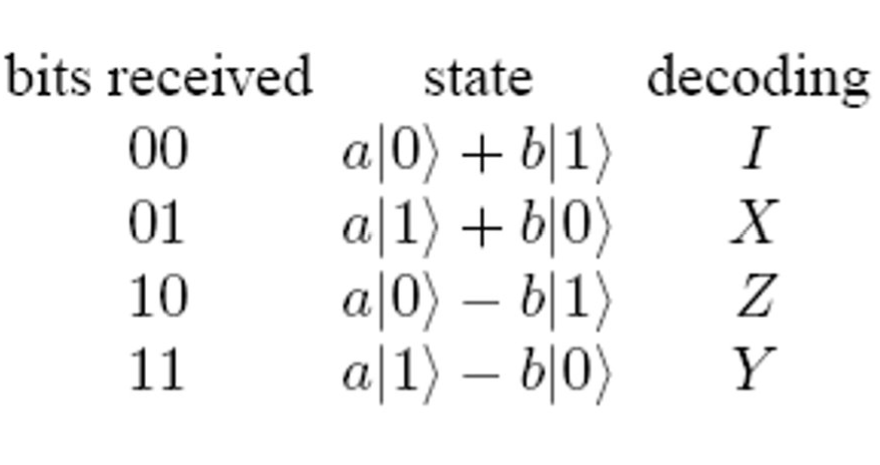
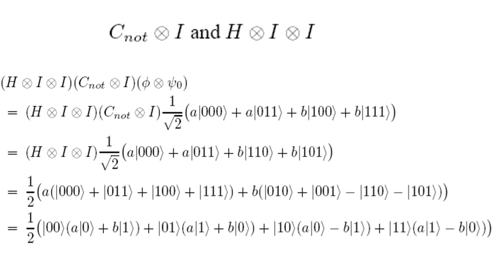
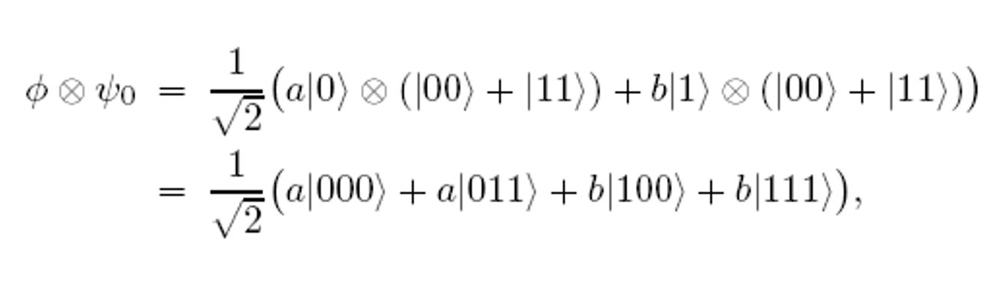

# WEEK 12 LECTURE 1 
In this lecture we discussed about quantum algorithms and looked at some theorems and experiments conserning them .

# Photon Experiment : 

We are already aware that if light passes through 2 polarizing filters which are at 90 degree to each other , then we see that no light passes through second filter . So now if we place a third filter in front of the second filter , we see that now light passes through the third filter but it's intensity reduces .
Hence we conclude that properties of light are different and difficult to explain using classical physics .

# Qubits :

-A quantum bit, or qubit, is a unit vector in a two-dimensional complex vector space for which a particular basis has been fixed.
-The linear superposition of a qubit's two orthonormal basis vectors can be used to express its general quantum state.
-It is denoted by {|0>, |1>} which are column vectors [1,0] and [0,1].
-Qubits can be in a superposition of |0> and |1> such as a|0> and b|1>, where a and b are complex numbers such that 
> |a|2 + |b|2 = 1
-Individual state spaces of n particles combine classically via the cartesian product; quantum states, on the other hand, combine via the tensor product.
-An n qubit system has 2^n basis vectors

# No-Cloning Theorem : 

It prohibits the creation of identical copies of an arbitrary unknown quantum state and says that all quantum operations must me unitary linear transformations on the state . 
 Proof : 
Consider a unitary transformation (U) that clones as follows, that is, U(|a0>) = |aa> for all quantum states |a>.

Now, consider |c> = 1/root(2) * (|a> + |b>). Then,

> U(|c0>) = 1/root(2) * (U(|a0>) + U(|b0>)) = 1/root(2)(|aa> + |bb>)

But since we initially assumed that U is a cloning transformation , we get a contradiction 
> U(|c0>) = |cc> = 1/2 * (|aa> + |ab> + |ba> + |bb>)

# Quantum Entanglement : 

It's a physical phenomena that occurs when a collection of particles is formed, interacts, or shares a shared space in such a way that each particle's quantum state cannot be described independently of the state of the other particles, even when they're separated by a significant distance.
For example , consider the state |00> + |11> .  cannot be described in terms of its qubits separately. We cannot a1, a2, b1 and b2 such that the tensor product of 

(a1|0> + b1|1>) and (a2|0> + b2|1>) = |00> + |11> = a1a2|00> + a1b2|01> + b1a2|10> + b1b2|11>

meaning a1b2 = 0, which means that either a1a2 or b1b2 is 0.

# Quantum Gates and Circuits : 

 There are various types of gates like Pauli X gate ,Pauli Y Gate , Pauli Z gate , Identity Gate , Hadamard Gate and CNOT Gate . 
 They are represented as matrices that change their state on the application of these gates . 
 These Gates are represented as :
I: |0> -> |0>, |1> -> |1> 
B: |0> -> |1>, |1> -> |0> 
Y: |0> -> -|1>, |1> -> |0> 
Z: |0> -> |0>, |1> -> -|1> 
H: |0> -> 1/root(2) * (|0> + |1>), |1> -> 1/root(2) * (|0> - |1>) 
Cnot -> |00> -> |00>, |01> -> |01>, |10> -> |11>, |11> -> |10>

# Quantum Teleportation : 

Here we try to reconstruct the exact quantum state transmitted at the receiver using classical bits .
Let us assume Alice and Bob are two friends where Alice is the sender and Bob is the reciever . 
Also , let us assume the qubit that we need to sent(which sender is not aware of) be : |ψ⟩=α|0⟩+β|1⟩ . 
We know that the sender cannot directly make a clone of the qubit and send it because of the no cloning theorem. As a result, we can only copy classical states (0s and 1s) and not superpositions.
They will have one qubit of entangled pair : 
$ψ_0 = 1/√2(|00› + |11›)$
The initial state thus could be expressed as a 3 qubit system: |ψ⟩⊗|e⟩, of which Alice controls
the first two bits and Bob controls the last one.
Sender performs a $C_{not}$ gate between the qubit she has and one of the entangled pair. The
state of the entire system of the 2 qubits that sender has is :

Applying the Hadamard gate on the first qubit :

Receiver understands how the state of his half of the entangled pair relates to the original state of sender's qubit when he receives the two classical bits from sender. By applying the appropriate decoding transformation to his part of the entangled pair, the receiver can recreate the initial state of the sender's qubit, :

