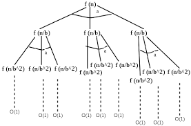
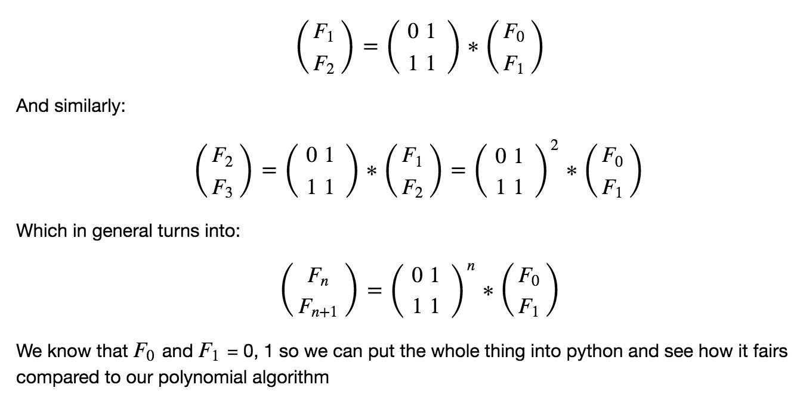

# Untitled

# Lecture-3

## INTRODUCTION:

In the third lecture we tried to understand divide and conquer algorithm and tried to find  and compare algorithms  to find some important divide and conquer problems like :

- .Finding the nth Fibonacci number using various methods like recursion, dynamic programming  and matrix multiplication.
- How to effectively multiple two numbers which are say n bit long.

## How to find nth Fibonacci number:

 we discussed primarily three methods to find the nth Fibonacci number

### Recursion:

In recursion , we simply wrote the definition of Fibonacci number and this was kind of brute force because we didn't do any optimisation.

So no proof is required as we literally wrote the definition in our code.

Since we would need to compute the full recursion tree , the time complexity would be of the order O(2^n).

</img>

```cpp
int fib(int a)
{
	if n==0 
		return 0;
	if n==1
		return 1;
	return fib(a-1)+fib(a-2);
}
```

### Dynamic Programming:

Later we realised we don't actually need to know to all the calculate Fibonacci value recursively for all the numbers again and again .

Once we get the value of a number we can store it in an array and directly use the value again. So now we don't need to compute the entire sub tree again , if we have the stored value we can directly use it and hence the time complexity would be of the order O(n^2). 

It is n squared because we would also need to add numbers would would again be of order n since  the nth Fibonacci number has approx .694 * n bits.

```cpp
int fib(int n)
{
    int f[n + 2];
    int i;
    f[0] = 0;
    f[1] = 1;
 
    for(i = 2; i <= n; i++)
    {
       f[i] = f[i - 1] + f[i - 2];
    }
    return f[n];
    }
};
```

### Matrix Multiplication:

We know that

</img>

Hence we can do matrix exponentiation and find the solution in O(log n) .This issue is to find how much time it would take to  multiply two numbers cause the school or naive method would take n squared time resulting in a net time of O(n^2 log n) which is pretty method.

So we need to find quicker methods of multiplying two numbers. 

### Direct Formula:

we  can use Binet's formula to calculate the nth Fibonacci number .

This formula can easily be derived using Generating functions.

$$F_n =(1/sqrt(5))( (phi)^n - 1/(phi)^n)$$

Where 

$$phi=(1+sqrt(5))/2$$

But since this involves irrational numbers , we would face 

issues dealing with precision. So we would need to store lot of decimal points to account for precision so in the end the complexity would almost be equal to matrix multiplication method.

## How to effectively multiply two numbers:

This is an open problem in programming and no one knows what the optimal solution can be.

We can obviously try to solve this using school method where we would  be multiplying each and every bit with each other and then doing addition but the complexity would be around n^2 which is not good.

Let us look at another method:

### Divide and Conquer: Karatsuba Algorithm

We know that we can multiply two complex numbers say (a+ib) and (c+id) , we would need to do 4 separate multiplications if we think naively.

But Karatsuba showed that we can do it in 3 by calculating only :

- a*c —1
- b*d  —2
- (a+b)(c+d)   —-3

Now  

$$(a+ib)(c+id)=(ac-bd)+i(ad+bc)$$

We already have a*c and b*d , hence we can calculate a*d+b*c my doing 

(3) - (2) -(1).

We can use this fact in our proof also.

Now say given two n bit numbers x and y.

We can follow the following algorithm:

- We can divide the both the n bit numbers into two  separate numbers each. This first one can be n/2 bits from the right and the second one can consist of the remaining bits.
- So now  x can be written as

    x = 2^(n/2) x_0 + x_1

    y = 2^(n/2) y_0 + y_1

- So we need to find x*y . Using the same method we used to multply two complex numbers, we can multiply x and y only using three multuplications.
- Three three multiplications would be as follows:
    - x_1 * y_1 —-a
    - x_0 * y_0 —-b
    - (x_0 + x_1) * (y_0 + y_1) —-c
- So the final equation would look something like

       Let

$$m=n/2$$

So we have 

$$ x * y=2^n*(a)  + m(c-a-b) + b$$

Hence apart from three multiplications we would also need to perform shift operations but they can easily be done in O(n).

- Call this recursive function separately for both the right and left halves.
- Put some base condition like if one of the numbers is 0 return 0 or if one of the numbers is 1 then return the other number.

 The Time complexity of the above algorithm would be 

$$T(n)=T(n/2) + T(n/2) T(1+(n/2)) + theta(n)$$

Solving this using Master theorem we would get the time complexity as 

O ( n^(log 3)) = O(1.585)    

The base of the logarithm is base 2.

Now the final complexity for Fibonacci number using Matrix multiplication would be around O( 1.585 * log(n)) which is better than O(n^2).

But the question is can we do better than this?

The answer is yes but surprisingly we don't know how much better we can do.

Using Fast Fourier Transform can give us the solution in 

O(n log n log log n) .

The best known till yet is 

$$O(nlogn)$$

But there might be even better algorithms with much better complexity . This is the best we know currently.

Hence we ended this lecture by understanding how to use divide and conquer among problems to improve their complexity by a lot.

PDF:  

[https://github.com/Github-Classroomtest/assignment-aryangupta290/blob/main/Week2_lecture3_2020101091.pdf](https://github.com/Github-Classroomtest/assignment-aryangupta290/blob/main/Week2_lecture3_2020101091.pdf)