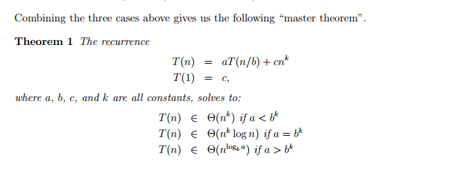
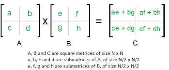
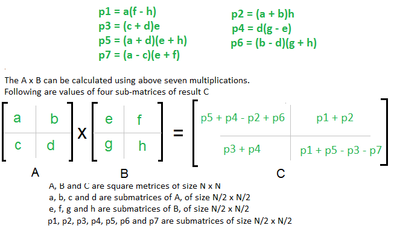

# Untitled

# Week 2 - Lecture 4

## Introduction:

In this chapter, we discussed few important theorems and problems which can be solved efficiently using divide and conquer.

- What is Master Theorem and how to find Time complexity using it .
- How to do matrix multiplication using Strassen algorithm  which is a divide and conquer algorithm
- Understanding merge sort
- How to find median of an unsorted array in linear time.

## Master Theorem:

The master theorem is used to find the time complexity of some recurrence relations. 

The general form of the equation is given by 

$$T(n)=a.T([n/b])+O(n^d)$$

So if we have a recurrence relation of this form then we can deduce time complexity of the algorithm using these conclusions:

</img>

We can visualise proof of master theorem using the following tree structure:

</img>

### Proof:

We can write the recurrence for the given equation as :

$$T(n)=n^d+a.(n/b)^d+a^2.(n/b^2)^d+.....+a^L.(n/b^l)^d$$

Where L will be the number of levels in the recursion

so L = log n with base b

Now we can take n^d common from the above equation and observe that we get a geometric series which can later be divided into cases as follows:

$$T(n)=n^d( 1+(a/b^d)^d + (a/b^d)^2+...+(a/b^d)^d)$$

Now we can observe that in this geometric series , the common ratio would be given as :

$$r=(a/b^d)$$

if r<1 , then 1 will dominate so complexity would be O(n^d)

if r==1 , then we can observe all terms would be one  and so the complexity would be O(n.L)=O(n.log a)

If r>1 , then last term would be dominant in which case we would get the complexity as O(n^L)= O(n^(log a))

The master Theorem can hence be used for getting time complexities quickly without having the need to fully solve the reccurence equation.

## Merge sort:

Merge sort is a sorting algorithm which works using the concept of divide and conquer.

We divide the given array into two  arrays of equal size , sort them recursively using the merge sort function and then merge the arrays.

We can also implement Merge sort in an iterative manner using a queue .

Initially we insert all the numbers into the queue but treat them as n individual arrays, then we take elements from arrays in pair and then merge them and push the resulting array to the back of the queue and repeat this until we just have a single element(array) in our queue.

The complexity of Merge sort can be written as 

$$T(n) =2T(n/2) + O(n)$$

Solving this using Master's theorem , We would get

$$O(nlogn)$$

### Lower Bound for comparison based sorting:

nlog n is the lower bound for comparison based sorting.

We can prove this easily by observing that there are n! ways to permute a given sequence and out of them only one would be the sorted sequence.

Let us assume that there would be k comparisons ,so to differenciate between these permutations we should perform atleast n! comparisions

Hence the comparisons we make should satisfy 2^k > n! , so k>log(n!)

So log(n!) < log(n^n)<nlog(n) 

Hence nlog n is the lower bound for comparison based sorting.   

## Matrix Multiplication:

Naively doing matrix multiplication, the time complexity would  be around n^3. But in reality we can do better than this using divide and conquer and using Strassen algorithm.

## Strassen Algorithm:

To multiply two 2 cross 2 matrices, ideally we would take 8 separate multiplications as follows,

</img>

however, we can do it only using 7 multiplications as follows

</img>

So here we are only required to perform 7 multiplications instead of 8 .

So the recurrence relation would now look something like :

$$T(n)=7.T(n/2) + O(n^2)$$

From master theorem, since log 7 base 2 >2 , we would get complexity as 

O(n^(log 7) = O(n^(2.81))

which is less than n^3.

Matrix multiplication is an open problem and we don't know if the best algorithm we have currently is most optimal or not.

BEST KNOWN COMPLEXITY: O(n^(2.37))

## Median of an unsorted array:

Firstly thinking naively, we can sort the whole array using say merge sort in nlog n and then find the [n/2] th element from the sorted array in O(1) . But we can do better than this using divide and conquer strategy.

We can use the following algorithm :

- Divide the given array into [n/5] groups and then sort each of those groups in constant time to find the median of each of those groups.

    and store them in another array.

- Now recursively we can find median of each of these subarrays and use them as pivot.
- Once we obtain the pivot , we can define 3 sets namely S_L,S_V and S_R where S_L would store the elements less than pivot , S_V would store elements equal to pivot and S_R for elements greater than pivot.
- Now we can observe the following relation:

    Say we want to find the kth smallest element in an array,so there would be three possible cases:

    select(S,k) =

    - if k<|S_L| , then select (S_L,k)
    - if k> |S_L| & k ≤  |S_L|+|S_V| , then return v
    - if k> |S_L| +|S_V| , then select (S_R , k - |S_L| - |S_V| )

    So just recursively call this function with the pivot as median and median to get the median of the array.

    ### Time Complexity Analysis:

    We can  observe the recursion to find the pivot of the n/5 elements would take T(n/5) time and O(n) would be required to traverse through the array and determine S_L,S_V,S_R.

    Now Let us understand that at least half of the medians found in step 1 of our algorithm described above would be greater than or equal to the [pivot](http://pivot.So) .

    So at least half of the n/5 groups would have elements which are greater than pivot and so no of elements greater than pivot would be around 

    $$m=(3n/10 )-6$$

    The no of elements less than pivot would also be same by similar argument .

    So we would only need to recurse for n-m elements in the subsequent recurse function.

    so the recurrence relation would look like 

    $$T(n)=T(n/5) +T((7n/10)+6)+O(n)$$

Now we can assume that complexity is around c.n and by inductive analysis can easily show that the algorithm indeed works at O(n) for higher n and for smaller n , we can use the normal sorting method to find the algorithm.

Hence for n≤140, T(n)=O(1) else T(n)=O(n).

PDF: Some images and equations might not be clear in md file so I am attaching this pdf.

[https://github.com/Github-Classroomtest/assignment-aryangupta290/blob/main/week2_lecture4_2020101091.pdf](https://github.com/Github-Classroomtest/assignment-aryangupta290/blob/main/week2_lecture4_2020101091.pdf)