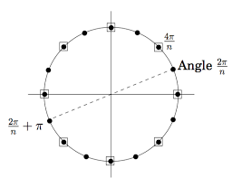

# Week 3 - Lecture 5

# Introduction:

In this lecture we saw another application of divide and conquer strategy , the key ideas discussed in the lecture were:

- How to multiply two polynomials in O(n^2)
- How to multiply two polynomials in O(nlog n) time using the fast fourier Transform
- How FFT uses divide and conquer and why it is one of the most important algorithms

## Representing polynomials :

We can represent polynomials in the form of coefficient using arrays.

So say we have stored all coefficients in an array coeff.

To find the coefficient of x^3, we just need to look up at coeff[3] in O(1).

## Naive way to multiply two polynomials:

Let as assume we have two polynomials A(x) and B(x) of say different degrees n and m respectively.

We can make the degrees of both the polynomials equal by adding terms with coefficient zero. 

Now without loss of generality , let us assume both have degree n.

By school method, we can multiply each term of A(x) with each term of B(x) and get the solution in O(n^2) .

Hence the naive method of finding product has complexity O(n^2).

 

## Fast Fourier Transform:

Instead of multiplying each term with each other, we can think in a different approach. 

For example: If we want to represent a line on a plane, we can join two points and they would give us a distinct line.

Similarly for a n degree polynomial , we just need n+1 points on the plane from where the polynomial would pass through and we would easily get the eqution.

This is the idea used behind the fast fourier transform.

Now let's try to use odd and even degree property to break down the polynomial so that we can implement what we thought above.

The most intuitive way to break down the polynomial would be like 

$$A(x)=A_e(x^2)+x.A_o(x^2)$$

Here , A_e is the sub polynomial with even degree terms from the original polynomial and A_o is the one with odd degree terms.

This reason why we did this was because now instead of calculating d=2*n+1 points, we would only need to find d/2 points because they would occur in conjugate pairs (x,-x).

But just doing this is not gonna work because after we apply  the recursion once , all points would become positive since (-x*-x=x^2) and hence our recursion would fail.

So we have to think of some way so that even after one recursion step, we would be left with +- pairs.

This can be done by introducing complex numbers!

## How to choose the points :

As stated above , we would need to use complex numbers.

The simplest way to do so would be by using roots or unity.

We know the roots of unity are conjugate and applying recursion would preserve the +- preperty.

</img>

## Interpolation:

Now given that we have found the d points ,we would also have to think of someway to get back the coefficients. 

This can easily be performed using matrix multiplication:

$$
\begin{bmatrix}
1 & x_0 & x_0^2 & ... & x_0^{n-1} \\
1 & x_1 & x_1^2 & ... & x_1^{n-1} \\
& & . \\
& & . \\
& & . \\
1 & x_{n-1} & x_{n-1}^2 & ... & x_{n-1}^{n-1}\\
\end{bmatrix}
\begin{bmatrix}
c_0 \\
c_1 \\
.\\
.\\
.\\
c_n
\end{bmatrix}
=
\begin{bmatrix}
C(x_0)\\
C(x_1)\\
.\\
.\\
.\\
C(x_n)
\end{bmatrix}
$$

x_0,x_1 etc are the points that lie on the polynomial we would get after multiplying the two given polynomials.

We would have already obtained the RHS using the fft algorithm as described [above](http://above.So) . So all that we need to do is take the inverse of the left most matrix and multiply it with the value matrix of RHS.

We can take inverse because x_0,x_1 ,etc are all distinct , hence matrix would be invertible.

So to get the coefficients we would just need to perform this computation:

$$\begin{bmatrix}
c_0 \\
c_1 \\
.\\
.\\
.\\
c_n
\end{bmatrix}
=
\begin{bmatrix}
1 & x_0 & x_0^2 & ... & x_0^{n-1} \\
1 & x_1 & x_1^2 & ... & x_1^{n-1} \\
& & . \\
& & . \\
& & . \\
1 & x_{n-1} & x_{n-1}^2 & ... & x_{n-1}^{n-1}\\
\end{bmatrix}^{-1}
\begin{bmatrix}
C(x_0)\\
C(x_1)\\
.\\
.\\
.\\
C(x_n)
\end{bmatrix}$$

Finding the inverse matrix would also be easy because we have chosen x_0,x_1 ,etc as the roots of unity .

The pseudo code for FFT algorithm looks like:

```python
def FFT(P):
n=len(P)
if n == 1:
return P
omega = e^{2pi/n}
P_e, P_o = [p0,p2,p4...],[p1,p3,p5,....]
ye,yo = FFT(P_e), FFT(P_o)
y = [0]*n
for j in range(n/2):
y[j] = y_e[j] + omega^j * y_o[j]
y[j+n/2] = y_e[j] - omega^j * y_o[j]
return y
```

## Time complexity:

To evaluate the d points of A(x) , we need to use recursion for the two polynomials fro where we need to extract d/2 points . Also , for getting the actual coefficients after getting the n points would also take O(n) time. So the overall recurrence equation would look something like 

$$T(n)=2.T(n/2)+O(n)$$

This is same as the merge sort recurrence relation we saw in last lecture and from Master Theorem we know that the time complexity of such an equation is 

$$O(nlog n)$$

This is a significant improvement over the school method of O(n^2).

This is why Fast Fourier Transform is considered as one of the most important algorithm of the 20th contury.

PDF:

Some images might not appear properly , so  I am attaching this PDF.

[https://github.com/Github-Classroomtest/assignment-aryangupta290/blob/main/Week3_lecture1_2020101091.pdf](https://github.com/Github-Classroomtest/assignment-aryangupta290/blob/main/Week3_lecture1_2020101091.pdf)