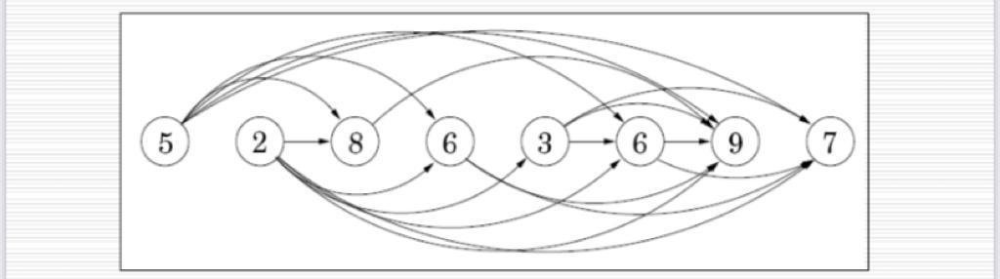

# Week 5 - lecture 9

# Introduction:

In this lecture , we started with the topic of dynamic programming and discussed the following key ideas:

- What is Dynamic Programming and how to represent it as a graph problem?
- Finding max and min path in a Directed a-cyclic graph.
- Finding the Longest Increasing Sequence

# Dynamic Programming :

In simple words , Dynamic Programming is just recursion with memorisation , or more formally we can define it as follows →

Dynamic Programming is a technique which is used in problems where Optimal Substructure and Overlapping Sub-problems property hold but not the Greedy Choice property .

Hence applying the Greedy Algorithm on such a problem would fail and hence studying dynamic Programming becomes important.

It uses the fact that we can calculate the answer for the current state using some relation with the relation state and then we can store that answer for the state in some array so that if we need it later , we won't need to do recursion again since the answer for the state is already stored and we can just extract it from that vector.

## DP as DAG ?

It is said that DP is just a DAG of sub-problems.

What this essentially means is that we can take all the sub problems that we need to solve as the nodes of the directed graph and the transition state can be represented as an edge of the problem.

Also we should try to understand why we are only considering a DAG.

Directed means there will be a sense of direction which would imply that we can solve a problem by knowing the answers to smaller sub problems of that problem . 

We also need the graph to be a-cyclic because let's say there is a directed graph like 1 →2 , 2→3 , 3→1 . Now to get ans for 3 , we would need 2, for 2 we would need ans for 1 but for 1 we again need for state 3 which was the problem we wanted to solve hence the graph cannot contain cycle.

That is why we only consider DAG .

# Shortest/Longest Path in a DAG:

This problem is sort of definition of dynamic programming . 

### Shortest Path :

The problem is :

Given a DAG , starting and destination node , find the smallest and longest path in that DAG. Distance between two nodes would be represented by the edge weight of the corresponding edge.

So let us try to think of how we can break the problem into smaller problems and whether there exits any optimal substructure between those problems!

We can try to observe that to go from source to destination , we can divide our journey into smaller path . So we can try to compute the smallest distance from s (starting node) to every other node and not just v (destination node) as that can help us to get the answer for v .

So understand that to compute the distance to every node , we would have to do some sort of ordering and this is exactly what toposort gives us . In toposort , if node a occurs before b , then it is only possible to go from a to b and not vice versa.

So now we have an ordering of the nodes. Now suppose we know the shortest path for all nodes till the node at position (i-1) , now to get ans for i th node , we can just go through all the set of edges that come into the i th node (back edges ) and since we have already computed the answer for them , we can just take the minimum of $dp[u]+wgt(u,v)$

where dp[u] is the shortest path to reach u from s and wgt is the weight of the edge u → v.

</img>

The pseudo code to find the shortest distance would be as follows:

```cpp
dp[] -> infinity // initialise distance to all nodes to infinity
dp[s] = 0 // s is the source node
for each v in V\{s} :
dp[v]=min{dp[u]+edgeweight(u,v)} [for all (u,v) belongs to E]
```

Here V is set of all nodes and E is set of all edges while $dp[v]$  denotes the shortest path from s to v.

### Longest Path in DAG:

This problem is very similar to problem above , we just need to change min too max in our pseudo code because the sub-structure is the same.

To get the answer for the i th node , we can find the maximum of all ways we can reach that node plus the corresponding edge weight .

So the code would look like :

 

```cpp
dp[] -> infinity // initialise distance to all nodes to infinity
dp[s] = 0 // s is the source node
for each v in V\{s} :
dp[v]=max{dp[u]+edgeweight(u,v)} [for all (u,v) belongs to E]
```

This problem is easy when we are talking about a DAG , but in general finding the Longest Path of a graph is an NP - Complete problem and hence no polynomial solution has been found till now . The longest path problem for a general graph is also called Hamiltonian Path.

# Longest Increasing Subsequence:

The problem statement is :

Given a sequence of integers , find the longest sub-sequence where the elements are strictly increasing .

We can again visualise this problem as a DAG of problems .

Consider a DAG where the elements of the array are the nodes and we connect an edge from $A[i]$   to $A[j]$ if $i<j$  and $A[i]<A[j]$ .

So for a sequence {5,2,8,6,3,6,9,7} , the corresponding DAG would look like this :

</img>

This problem is exactly similar to the Longest Path problem we solved above .

So $dp[i]$  is the LIS ending at i , so the answer for $dp[i]$  would be 1 plus the maximum over all j such that   $i>j$  and $A[i]>A[j]$ . 

so the pseudo code would be as follows :

  

```cpp
int lis(vector<int> &A) {
int n = A.size();
vector<int> dp(n, 1);
for (int i = 0; i < n; i++) 
{
	for (int j = 0; j < i; j++) 
	{
		if (a[j] < a[i])
			dp[i] = max(dp[i], dp[j] + 1);
	}
}
int ans = dp[0];
for (int i = 1; i < n; i++) 
{
	ans = max(ans, dp[i]);
}
return ans;
}
```

PDF: So that images and maths equations come clearly

[https://github.com/Github-Classroomtest/assignment-aryangupta290/blob/main/week5_lecture2_2020101091.pdf](https://github.com/Github-Classroomtest/assignment-aryangupta290/blob/main/week5_lecture2_2020101091.pdf)