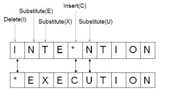

# WEEK 6 - Lecture 1

# INTRODUCTION:

We continued our discussion on Dynamic Programming and tried to expand our understanding by trying to solve 'Edit Distance'  Problem.

# EDIT DISTANCE:

Given two strings A and B , we need to find the minimum number of insert,delete or replace operations so as to convert A to B.

This problem is equivalent to asking alignment queries that is the extent to which these two strings align or match.

### Example:

Let us try to understand the problem with the help of an example :

Suppose A = INTENTION and B = EXECUTION

</img>

This is how the operations would look like . 

So we can delete the first I , substitute N , T and so on and we can observe that we can convert the string A into B using a minimum of 5 operations.

Of course we can convert using other methods too like deleting all letters in A and then inserting letters of B into A but since we are required to find the minimum number of such operations , our answer would be 5.

## Dynamic Programming Solution:

To apply dynamic programming in this problem , it should have optimal substructure and overlapping problems property . 

Let us visualise both of them :

- Sub-problem property:

We can very easily define a sub-problem for the given problem at hand.

Say the length of string A is n and that of B is m , then we can ask a problem like what are the minimum number of delete,insert and replace operations to convert come prefix of A say $A[i]$(prefix of first i letters of A )  and similarly B say $B[j]$  (prefix of first j letters of B) .

- Sub-structure property :

Since we have already defined the sub - problem , let us see what options do we have for each value of i and j .

a) Delete a character from string . 

b) Insert a  character into string.

c) Substitute one character into another .

So let us consider $dp[i][j]$ as the minimum number of operations that we have to perform to convert the prefix of first i character of A into the prefix of first j character of B .

So let us try to understand the transition :

a) When $A[i]==B[j]$ , we don't need to preform any of those operations so $dp[i][j]=dp[i-1][j-1]$ .

b) When they do not match , then we have the following three options;

- If we inserting a character in A , then

      $dp[i][j]=1+dp[m][n-1]$.

- If we are removing a character in A , then

       $dp[i][j]=1+dp[i-1][j]$

- If we have to replace a character in A , then

     $dp[i][j]=1+dp[i-1][j-1]$

So to calculate $dp[i][j]$ , we need to take the minimum of these three possible options.

So now we can see that there are only three possible transitions .

The pseudo code will be something like this :

```cpp
for i = 0,1,2,...,m
dp[i][0] = i
for j = 0,1,2,...n
dp[j][0] = j
for i = 1,2,...m
for j = 1,2,...n
dp[i][j] = min{(1 + dp[i-1][j]),(1 + dp[i][j-1]),(dp[i-1][j-1] + check(i,j))}
return dp[m][n]
```

 PDF link :

[https://github.com/Github-Classroomtest/assignment-aryangupta290/blob/main/week6_lecture1_2020101091.pdf](https://github.com/Github-Classroomtest/assignment-aryangupta290/blob/main/week6_lecture1_2020101091.pdf)