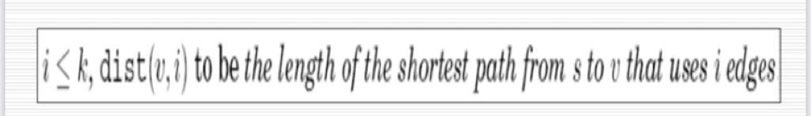
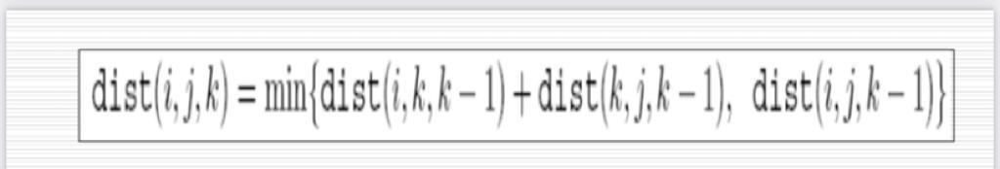
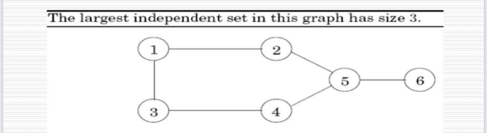

# WEEK 7 - Lecture 1

# INTRODUCTION:

In this lecture we discussed the following problems based on dynamic programming :

- Shortest Reliable Path problem
- Floyd Warshall
- Independent Set

# Shortest Reliable Path :

In this problem ,we are given a graph with say n nodes and m edges and two nodes namely start node (s) and destination node (t) and our task is to find the shortest distance from node s to t which uses at most k edges.

This is a real life problem because say for example in networking , we not only need to find the shortest path for delivering the packet but also the number of edges it need to go through as with every edge the probability of package dropping increases.

This problem can be solved using Dynamic Programming , let us see how:

## **DP approach:**

Our first task is to identify the underlying sub-problem , so we consider the $dist[i][j]$  as the shortest distance from s to node i that uses  j edges in total.

</img>

So we can easily observe that the transition would look something like :

</img>

Hence there is optimal substructure property since we can reach any node from the connecting edges and so we won't need to recalculate the distance .

The time complexity of the solution would be around $O(k.|E|)$ since we have k max edges that we can go through and to calculate for each k , we would need to go through all the edges.

The pseudo code would be like :

```cpp
int dist[n][k];
dist[]->infinity //initialise distance to all nodes to infinity
dist[s][0]=0 ; // base case
for each i till k:
	for each v in V:
		dist[v][i]=min{dist[u][i-1]+edgewgt(u,v)} for all (u,v) belong to E
int ans= min{dp[v][i]} where i is from 1 to k
```

The algorithm is almost similar to bellman ford but only difference is we run the outer look only k times rather than n-1 times.

# Floyd Warshall:

This is also known as the all pair shortest path problem:

Given a graph with n nodes and m edges, our task is to find the minimum distance between all pair of points .

We can try to solve it using Dijkstra but it would take too much time if the graph is dense , hence Floyd Warshall allows us to find it in a reasonable time complexity.

Also Dijkstra won't work in cases where edge weight is negative .

Here also we define a $dist[i][j][k]$ which denotes the minimum distance from node i to node j using the first k nodes as intermediaries.

Hence we pick the vertices one by one and update all shortest paths which include the picked vertex as an intermediate vertex in the shortest path.

So to find it's value , we can consider two possible cases : 

</img>

- We don't need to use the k'th node and hence a possible contender would be $dist[i][j][k-1]$.
- If we use the k'th node , we would have the distance as $dist[i][k][k-1]+dist[k][j][k-1]$.

This is the optimal sub-structure in this algorithm.

So we would need to take the minimum of these two.

</img>

The pseudo code for the problem would look like :

```cpp

dist[]=infinty;
for all (i,j) in E:
dist(i,j,0) = edgewgt(i,j)
for k = 1 to n:
	for i = 1 to n:
		for j = 1 to n:
			dist(i,j,k) = min(dist(i,k,k-1) + dist(k,j,k-1), dist(i,j, k-1));
```

As we can observe there are three nested for loops and hence the time complexity of the algorithm would be $O(n^3)$ .

# Independent Set :

An independent set is defined as  a subset of nodes S of V if there are no edges between them. This means that we don;t have a connecting edge between any pair of nodes in the subset S.

So our task is to find the largest size of such a subset.

For Example :

</img>

This graph has independent set of size 3 since {1,4,6} don't have any connecting (direct) edges between them.

This problem is NP-Hard for a general graph however it can be solved efficiently using dynamic programming if we have a tree. So let us consider the DP-approach in case of a tree.

## DP approach:

Let us try to understand the underlying sub-structure ,  we can denote $I[u]$ as the size of the largest independent set of subtree hanging from some node u.

We can see that for a leaf node, it's value will always be one since we can take that node itself.

For other case , let us understand the options we have :

- If we include the node u in our set , then we can't include any of the children of node u but we can include the grandchildren(if any) of u.
- If we don't include the node u , then we can find the value of I[v] for all children (v→ child of u) of u since we can include all of them as we excluded u from our set.

So we would have to consider both these cases and take the maximum of them.

</img>

This is the sub-structure for this problem.

To execute this algorithm ,we can do a dfs and for every node while doing dfs , we can find the value of I[u] and in the end return I[1] as the answer if 1 is the node from where we started our dfs.

Hence the time complexity for the solution would be around O(|V|) since the number of edges are of the same order as the number of vertices because we have a tree.

# Food for thought:

Given a tree with n nodes , our task is to find the shortest distance between any two given nodes in a reasonable time complexity.

One way to do this is say the query is (u,v) , we can find the distance to all nodes from u using dynamic programming as we have seen earlier but this method would be too costly .

Rather we can root the tree at some vertex say 0 and pre-calculate the distance from root to all nodes in $O(n)$ using dp .

Now for every query , we can find the Lowest common Ancestor (LCA) of the given two nodes in $O(log n)$  using any standard approach like bianry lifting and solve the problem in a much better complexity if we know this property of a tree.

$$dist(u,v)=dist(1,u)+dist(1,v)-dist(1,lca)$$

where LCA is the lowest common ancestor from u to v.

Hence we see how dynamic programming can help us to solve such a complicated problem in a good time complexity.

</img>
